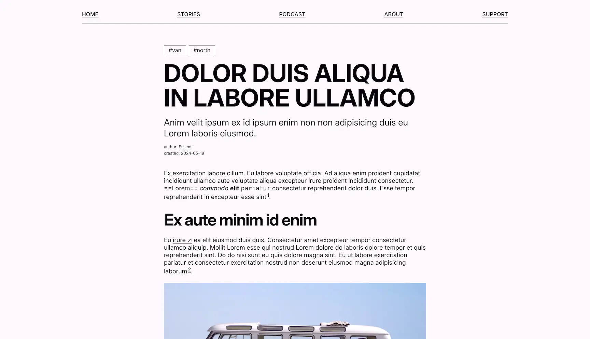
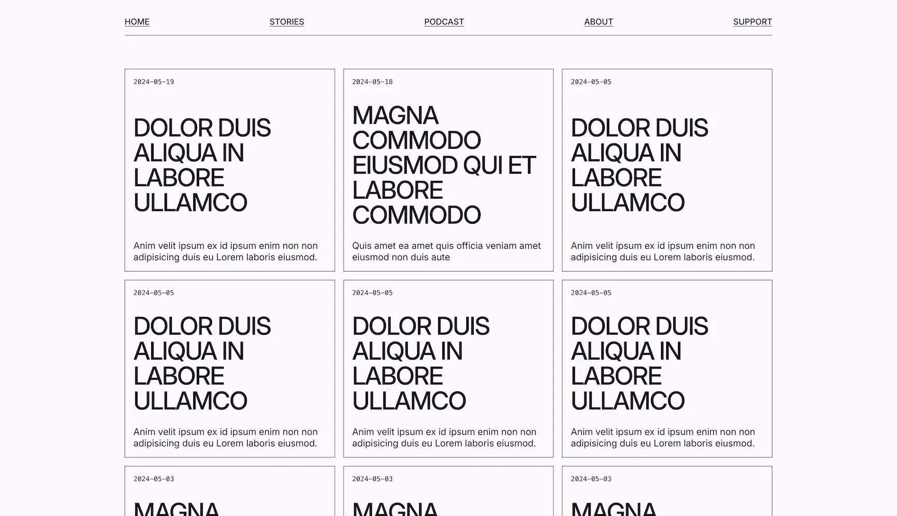

# Kilde

— is clean and simple template for an independent media and/or zine.

## Features

- Ready-to-go web-template made with [Astro](https://astro.build);
- Distinctive typography — [Inter](https://rsms.me/inter/) by the legendary [Rasmus Andersson](https://rsms.me/). You just can't go wrong with this one;
- Sustainable code and design;
- Comes with the `site.js` — a single source of truth to update content, and don't waste any time jumping between files;
- Integrated [Collections](https://docs.astro.build/en/guides/content-collections/) — just start writing;
- Includes articles and podcasts — and you can get rid of them if you need;


## Scores

- [100 Performance Score according to PageInsights](https://pagespeed.web.dev/analysis/https-kilde-three-vercel-app/xcjvj0n1xe?form_factor=desktop)
- [A+ 92 Website Carbon Calculator Score](https://www.websitecarbon.com/website/kilde-three-vercel-app/)
- [A Digital Beacon Carbon Footprint](https://digitalbeacon.co/report/kilde-three-vercel-app)

## Writing content

Three types of content are integrated into the template:

- `articles` — of `content` type. To add an article, create a new `.md` file in the `src/content/articles` folder;
- `podcasts` — same here. To add a new podcast, create a new `.md` file in the `src/content/podcasts` folder;
- `authors` — of `data type`. Add a new author by creating a new `.json` file in the `src/content/authors` folder.

When creating `md` files, don't forget the _frontmatter_ — the thing between the `---`. It allows for quering the data. More on what types of fields there are and for which type, have a look at the `config.ts` file in the `src/content` folder.



## Structure

```plaintext
/
├── public/
│   ├── css/
│   │   └── global.css
│   ├── favicon.svg
│   └── images/
│       ├── article.webp
│       └── cover.webp
├── src/
│   ├── components/
│   │   ├── Card.astro
│   │   ├── Hero.astro
│   │   ├── Footer.astro
│   │   ├── Header.astro
│   │   ├── Navigation.astro
│   │   ├── Paginator.astro
│   │   ├── Podcast.astro
│   │   ├── Tag.astro
│   ├── content/
│   │   ├── articles/
│   │   │   ├── lorem1.md
│   │   │   └── lorem1.md
│   │   ├── authors/
│   │   │   └── essens.json
│   │   ├── config.ts
│   │   └── pages/
│   │   │   ├── about.md
│   │   │   └── support.md
│   ├── layouts/
│   │   └── Layout.astro
│   ├── pages/
│   │   ├── about.astro
│   │   ├── index.astro
│   │   ├── rss.xml.js
│   │   ├── [slug].astro
│   │   ├── stories/
│   │   │   └── [...page].stro
│   │   ├── support.astro
│   │   └── tags/
│   │       └── [tag].astro
│   └── site.js
└── package.json
```



## Customization and Development

To change things like a site title, description, have a look at `src/site.js`.

In case you want to change styles and such, dive intro the `public/css/global.css`. Mind the variables (`--something`): changing them might be the easiest way to change how the website looks.

There is also `utils.js`. It contains all the queries used to get data — articles, podcasts, and whatnot. You can play around with it.
